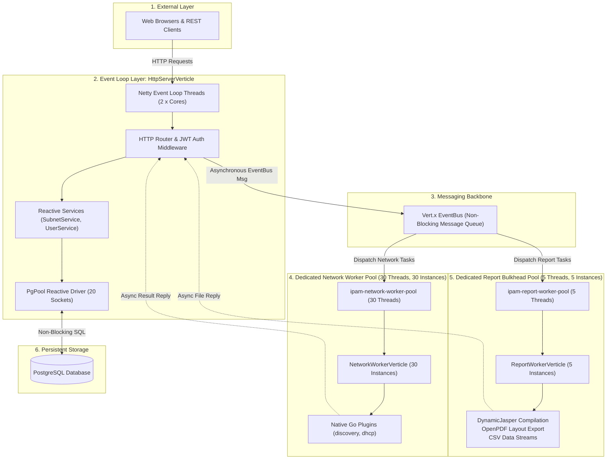

# Motadata IPAM (IP Address Management)


**Motadata IPAM** is an enterprise-grade, high-performance web-based IP Address Management system designed to discover, track, allocate, monitor, and audit IPv4 subnets, IP addresses, DHCP servers, and rogue network devices.

The system is built on **Eclipse Vert.x 5** using a fully asynchronous, reactive **Multi-Reactor & Dedicated Worker Pool Architecture** backed by **PostgreSQL** (`vertx-pg-client`), with high-speed **Go Native Plugins** for network subnet discovery and DHCP collection.

---

## Table of Contents
- [Key Features](#key-features)
- [Architecture & Concurrency Model](#architecture--concurrency-model)
- [Threading & Dedicated Worker Pool Design](#threading--dedicated-worker-pool-design)
- [Modular Project Structure](#modular-project-structure)
- [Technology Stack](#technology-stack)
- [Prerequisites](#prerequisites)
- [Configuration](#configuration)
- [Database Setup & Migrations](#database-setup--migrations)
- [Build & Run Instructions](#build--run-instructions)
- [REST API Reference](#rest-api-reference)
- [Testing & Verification](#testing--verification)

---

## Key Features

### 1. Subnet & Supernet Management
- **Hierarchy & Organization**: Group subnets by Supernet, Gateway, and Category.
- **Real-Time Utilization**: Live tracking of `TOTAL`, `USED`, `AVAILABLE`, `RESERVED`, and `TRANSIENT` IP counts with visual utilization gauges.
- **Bulk Operations**: Add IP ranges, batch-edit statuses, reserve IP blocks, and delete ranges reactively.
- **CSV Import / Export**: Import subnet allocations from CSV files; export complete IP tables to CSV and PDF.

### 2. IP Request & Approval Workflow
- **Self-Service Portal**: Internal teams can submit static IP allocation requests specifying Device Type (Server, VM, Container, Router, Switch, Firewall, AP, IoT), Allocation Duration (Permanent, 30/60/90 Days, 6 Months, 1 Year, Temporary), Quantity, and Business Justification.
- **Admin Review Queue**: Network administrators review requests, modify subnet assignments, select specific available IPs from interactive grids, enter approval/rejection remarks, and trigger one-click IP reservation.
- **Automated Lifecycle**: Approved requests automatically transition target IPs to `USED`, update subnet utilization metrics, and write immutable audit records to the event log.

### 3. Network Discovery & Live Probing
- **High-Speed ICMP Scans**: Concurrent subnet ping sweeps with real-time status updates via native Go plugins.
- **TCP Port Probing**: Multi-port scanning (e.g. ports 21, 22, 23, 25, 53, 80, 443, 3306, 3389, 5432, 8080).
- **DNS & Reverse DNS**: Automatic hostname discovery and reverse DNS resolution.
- **Traceroute**: Network path inspection and hop-by-hop latency measurement.
- **Go Discovery Engine**: Standalone high-concurrency Go binary plugin for massive CIDR sweeps.

### 4. Rogue Device & Threat Detection
- **Unauthorized IP Identification**: Flags unknown MAC addresses and unauthorized devices on active subnets.
- **Trusted MAC Whitelist**: Bulk import and management of authorized device MAC addresses.
- **Instant Categorization**: Distinguish between `TRUSTED` and `UNAUTHORIZED / ROGUE` assets.

### 5. DHCP Server Management
- **Multi-Vendor Support**: Windows DHCP Server and Cisco DHCP monitoring.
- **Scope Utilization**: Real-time lease tracking, active reservations, and free address pool metrics.
- **Automated Sync**: Background DHCP polling via dedicated Go collection worker.

### 6. Alerts & Event Audit Trail
- **Live Alert Stream**: Subnet capacity threshold alerts (e.g., >80% used), rogue device alerts, and IP conflict notifications.
- **Event Timeline**: Audit log recording every user action, IP request status change, subnet scan, and system event.
- **Automated Maintenance**: Background cleanup timers to prune resolved alerts and archive logs.

### 7. Document Reporting & Scheduling
- **Custom PDF Reports**: Generated using DynamicJasper and OpenPDF layout engines.
- **Spreadsheet Exports**: CSV export streams for Subnets, Alerts, Events, and DHCP data.
- **Report Schedulers**: Cron-based automated report delivery with recipient email lists.

### 8. Security & RBAC
- **JWT Authentication**: Token-based authentication with HS256 signatures, 30-day lifespans, and cookie fallbacks.
- **Granular Permissions**: Role-Based & Policy-Based Access Control (`ROLE_ADMIN`, `PERM_SUBNET_READ`, `PERM_SUBNET_WRITE`, `PERM_ALERTS_READ`, etc.).
- **Password Hashing**: Industry-standard BCrypt password encryption.

---

## Architecture & Concurrency Model

The application is architected around **Eclipse Vert.x 5** and **Netty**, adopting a **Decoupled Multi-Verticle & Dedicated Bulkhead Worker Pattern**.



---

## Threading & Dedicated Worker Pool Design

### 1. Verticles & Concurrency Breakdown

| Verticle | Threading Model | Worker Pool Name | Pool Size | Instances | Purpose & Responsibilities |
| :--- | :--- | :--- | :--- | :--- | :--- |
| **`MainVerticle`** | Standard | EventLoop | 1 | 1 | Bootstrap deployer. Initializes `AppConfig`, `PgClientProvider`, `DatabaseInit`, `JobScheduler`, and deploys application verticles. |
| **`HttpServerVerticle`** | Standard | EventLoop | `2 * Cores` | `2 * Cores` | Runs strictly on Netty Event Loop threads. Mounts HTTP Server on port `8080`, manages JWT auth, serves static web assets, and handles REST CRUD endpoints via non-blocking `PgPool`. |
| **`NetworkWorkerVerticle`** | `ThreadingModel.WORKER` | `ipam-network-worker-pool` | **30** | **30** | Consumes EventBus messages for ICMP ping sweeps, TCP port probing, reverse DNS lookups, traceroute probes, and Go plugin execution. 30 instances ensure all 30 threads run in parallel. |
| **`ReportWorkerVerticle`** | `ThreadingModel.WORKER` | `ipam-report-worker-pool` | **5** | **5** | Consumes EventBus messages to compile DynamicJasper reports, OpenPDF documents, and CSV exports in an isolated bulkhead pool strictly capped at 5 threads to protect JVM heap. |

---

### 2. Bulkhead Isolation (Anti-Starvation)

| Feature | `ipam-network-worker-pool` (30 Threads) | `ipam-report-worker-pool` (5 Threads) |
|---|---|---|
| **Core Tasks** | Native Go CIDR Discovery, ICMP Pings, Port Scans, DNS, CSV Imports | DynamicJasper Compilation, OpenPDF Rendering, CSV Disk Exports |
| **Scaling Goal** | Maximized for high network concurrency (30 parallel scans) | Strictly capped at 5 to protect JVM Heap from OOM |
| **Isolation** | Heavy PDF generation can never block network discovery | Network scan traffic cannot starve export threads |

1. **Zero Thread Starvation**: Heavy PDF rendering tasks never consume threads needed for network discovery.
2. **Zero Event Loop Latency**: All blocking code (file I/O, subprocess execution, PDF compilation) is isolated from the Netty Event Loop.
3. **Memory Protection (OOM Guard)**: Capping the report pool at 5 threads prevents out-of-memory errors during bursts of report requests.

---

### 3. EventBus Messaging Protocol

| EventBus Address | Message Payload (Input) | Reply Payload (Output) | Consumer Verticle |
| :--- | :--- | :--- | :--- |
| `ipam.worker.network.ping` | `{"ip": "192.168.1.10", "timeout": 1000}` | `{"success": true, "ip": "...", "reachable": true, "status": "ONLINE"}` | `NetworkWorkerVerticle` |
| `ipam.worker.network.scan` | `{"subnetId": 1, "subnetAddress": "192.168.1.0", "cidr": 24}` | `{"success": true, "totalIps": 254, "activeIps": 42, "message": "..."}` | `NetworkWorkerVerticle` |
| `ipam.worker.network.dns` | `{"ip": "192.168.1.10"}` | `{"success": true, "ip": "...", "hostname": "gw.local", "resolved": true}` | `NetworkWorkerVerticle` |
| `ipam.worker.network.portscan`| `{"ip": "192.168.1.10", "ports": [80, 443, 22]}` | `{"success": true, "ip": "...", "openPorts": [80, 443]}` | `NetworkWorkerVerticle` |
| `ipam.worker.network.importCsv`| `{"csvText": "...", "subnetId": 1}` | `{"success": true, "imported": 250, "message": "..."}` | `NetworkWorkerVerticle` |
| `ipam.worker.network.discoveryScan`| `{"subnetCidr": "192.168.1.0/24", "timeoutMs": 1000}` | `{"subnetCidr": "...", "totalHosts": 254, "activeCount": 12, ...}` | `NetworkWorkerVerticle` |
| `ipam.worker.network.dhcpScan`| `{"credentialId": 1, "hostAddress": "192.168.1.1", "type": "windows"}` | `{"status": "SUCCESS", "scopes": [...], "durationMs": ...}` | `NetworkWorkerVerticle` |
| `ipam.worker.report.subnet.pdf`| `{"data": [...], "subLabel": "192.168.1.0"}` | `{"success": true, "filename": "SubnetIP_Export_1.pdf", "size": 18240}` | `ReportWorkerVerticle` |
| `ipam.worker.report.vendor.pdf`| `{"data": [...], "subLabel": "All"}` | `{"success": true, "filename": "Vendor_Summary_1.pdf", "size": 12400}` | `ReportWorkerVerticle` |
| `ipam.worker.report.dynamic.pdf`| `{"title": "...", "data": [...], "columns": [...]}` | `Buffer` (Raw PDF binary stream) | `ReportWorkerVerticle` |

---

## Modular Project Structure

```text
IPAM_Real/
├── config/
│   └── ipm-conf.yml                     # Central application YAML configuration
├── database/
│   └── migrations/                      # Versioned SQL schema migration scripts (Flyway)
├── go-engine/
│   ├── go.mod
│   └── ping.go                          # Standalone CLI ping utility
├── go-services/
│   ├── common/                          # Shared Go network and CIDR utilities
│   ├── discovery/                       # Subnet Auto-Discovery Plugin
│   ├── dhcp/                            # DHCP Collector Plugin
│   └── go.mod
├── vertx-app/
│   ├── pom.xml                          # Maven build configuration
│   ├── src/main/java/com/motadata/ipam/
│   │   ├── IpamApplication.java         # Main Process Bootstrap Entry Point
│   │   ├── MainVerticle.java            # Deployer & Orchestrator Verticle
│   │   ├── core/                        # Infrastructure & Core Services
│   │   │   ├── config/                  # AppConfig loader
│   │   │   ├── db/                      # PgClientProvider & DatabaseInit
│   │   │   ├── scheduler/               # JobScheduler & VertxScheduledJob
│   │   │   └── verticle/                # HttpServerVerticle, NetworkWorkerVerticle, ReportWorkerVerticle
│   │   └── feature/                     # Domain Feature Modules (Model, Service, Router)
│   │       ├── alert/                   # AlertService, AlertRouter, AlertCleanupJob
│   │       ├── auth/                    # JwtAuthProvider, JwtAuthHandler, AuthRouter, UserService
│   │       ├── dhcp/                    # DhcpService, DhcpRouter, DhcpScanJob
│   │       ├── discovery/               # DiscoveryService, SubnetScanJob
│   │       ├── event/                   # EventService, EventRouter
│   │       ├── report/                  # ReportService, ReportRouter, ReportSchedulerJob
│   │       ├── settings/                # SettingsService, SettingsRouter
│   │       └── subnet/                  # SubnetService, SubnetRouter, SubnetIPActionService
│   ├── src/main/resources/
│   │   ├── db/init_ipam_postgres.sql    # PostgreSQL schema & initial seed data
│   │   ├── log4j2.xml                   # Logging configuration
│   │   └── webroot/                     # Web UI, Kendo UI grids, controllers & CSS
│   └── src/test/java/com/motadata/ipam/ # JUnit 5 test suite
├── pom.xml                              # Root Maven project POM
└── README.md                            # Comprehensive project documentation
```

---

## Technology Stack

| Domain | Technologies |
| :--- | :--- |
| **Backend Core** | Java 21, Eclipse Vert.x 5.0.0 (`vertx-core`, `vertx-web`, `vertx-auth-jwt`, `vertx-sql-client`, `vertx-pg-client`) |
| **Database** | PostgreSQL 12+, Flyway schema scripts, Vert.x Reactive PgPool |
| **Security** | JWT (HS256), BCrypt, PBAC/RBAC route permission handlers |
| **Document Generation** | DynamicJasper 5.0.9, JasperReports 6.3.0, OpenPDF 1.3.30 |
| **Frontend** | HTML5, CSS3, JavaScript (ES6+), jQuery, Kendo UI, Bootstrap |
| **Native Plugins** | Go 1.20+ (Discovery & DHCP CLI plugins via JSON IPC) |
| **Build & Test** | Maven 3.8+, JUnit 5, Vert.x JUnit 5 Extension, Mockito, AssertJ |

---

## Prerequisites

Ensure the following tools are installed on your system:

- **JDK 21** or later (`openjdk-21-jdk`)
- **Maven 3.8.0** or later
- **PostgreSQL 12+**
- **Go 1.20+** (for Go discovery/DHCP plugins)

---

## Configuration

The application reads configuration from `config/ipm-conf.yml`:

```yaml
server-port: 8080
server-host: localhost
min-memory: 1024
max-memory: 2048

# PostgreSQL Database Configuration
db-host: 127.0.0.1
db-port: 5432
db-name: ipam_db
db-user: postgres
db-password: password

# Network Discovery & Scan Tuning
max-ping-check-timeout: 10
max-ping-check-retry-count: 2
max-concurrent-ping: 500
process-request-timeout: 1200
```

---

## Database Setup & Migrations

1. **Create the PostgreSQL Database**:
   ```bash
   createdb -h localhost -p 5432 -U postgres ipam_db
   ```

2. **Automatic Initialization**:
   Upon startup, `DatabaseInit.java` automatically executes `init_ipam_postgres.sql` and applies schema migrations reactively.

---

## Build & Run Instructions

### 1. Build and Run the Vert.x Application

From the root repository directory:

```bash
# Clean, compile, and package the executable fat JAR
mvn clean package -DskipTests

# Run the fat JAR
java -jar vertx-app/target/vertx-ipam-4.0.0-fat.jar
```

Or run directly with Maven:
```bash
cd vertx-app
mvn exec:java
```

The web application is accessible at:
```text
http://localhost:8080
```

**Default Credentials**:
- **Username**: `admin`
- **Password**: `admin`

---

## REST API Reference

### Authentication & Authorization
| Method | Endpoint | Description | Auth Required |
| :--- | :--- | :--- | :--- |
| `POST` | `/loginUser.html` | Authenticates user credentials, sets session and JWT cookies | Public |
| `GET` | `/logoutUser.html` | Invalidates session and clears tokens | Public |
| `GET` | `/validatePermission/` | Returns current user role, authorities, and permissions | Token Required |
| `GET` | `/globalSearch/` | Searches subnets, IPs, and events across the system | Token Required |

### Subnets & IP Management
| Method | Endpoint | Description |
| :--- | :--- | :--- |
| `GET` | `/subnet/` | Returns all subnets with CIDR, IP counts, and gateway info |
| `POST` | `/subnet/` | Creates a new subnet definition |
| `PUT` | `/subnet/` | Updates subnet details |
| `DELETE` | `/subnet/:id` | Deletes a subnet and cleans associated IP records |
| `GET` | `/subnetIp/` | Lists IP addresses for a subnet with pagination & filtering |
| `POST` | `/subnetIp/scan` | Dispatches asynchronous subnet ICMP scan to `NetworkWorkerVerticle` |
| `POST` | `/subnetIp/addRange` | Batch inserts a range of IP addresses |
| `POST` | `/subnetIp/updateRange` | Batch updates status (`USED`, `AVAILABLE`, `RESERVED`, `TRANSIENT`) |
| `POST` | `/subnetIp/deleteRange` | Batch deletes a range of IP addresses |
| `POST` | `/subnetIp/importCsv` | Imports IP definitions from uploaded CSV |
| `GET` | `/subnetIp/exportCsv` | Exports subnet IP records to CSV |
| `GET` | `/subnetIp/exportPdf` | Exports subnet IP records to PDF |

### IP Request & Approval Workflow
| Method | Endpoint | Description |
| :--- | :--- | :--- |
| `GET` | `/ipRequests/` | Returns all IP requests with status, device type, and duration |
| `POST` | `/ipRequests/` | Submits a new IP request from self-service portal |
| `POST` | `/ipRequests/approved` | Approves request, allocates selected IPs as `USED`, updates stats |
| `POST` | `/ipRequests/rejected` | Rejects request with admin remark |

### Alerts, Events & Reports
| Method | Endpoint | Description |
| :--- | :--- | :--- |
| `GET` | `/alerts/` | Returns active alert stream records |
| `GET` | `/event/` | Returns event audit logs and timeline records |
| `GET` | `/reports/schedulers` | Lists configured report schedules |
| `POST` | `/reports/schedulers` | Creates/updates report schedule cron definition |
| `GET` | `/exportsubnetIpByReportTimeline/` | Generates on-demand timeline report (PDF / CSV) |

---

## Testing & Verification

Run the comprehensive test suite:

```bash
# Run all unit tests
mvn test

# Run specific test classes
mvn test -Dtest=SecurityTest,JsonPayloadTest,AppConfigTest,SchedulerTest,MainVerticleTest
```

Test coverage includes:
- **`SecurityTest`**: JWT token generation, expiration, claims extraction, and BCrypt password validation.
- **`SchedulerTest`**: Vert.x timer lifecycle, job scheduling, and cron expression validation.
- **`JsonPayloadTest`**: JSON serialization and model binding for IPAM domain entities.
- **`AppConfigTest`**: YAML configuration loading and default fallbacks.
- **`MainVerticleTest`**: Verticle deployment, HTTP routing pipeline, login redirects, and permission handlers.

---

## License

This project is developed for enterprise IPAM infrastructure. All rights reserved.
